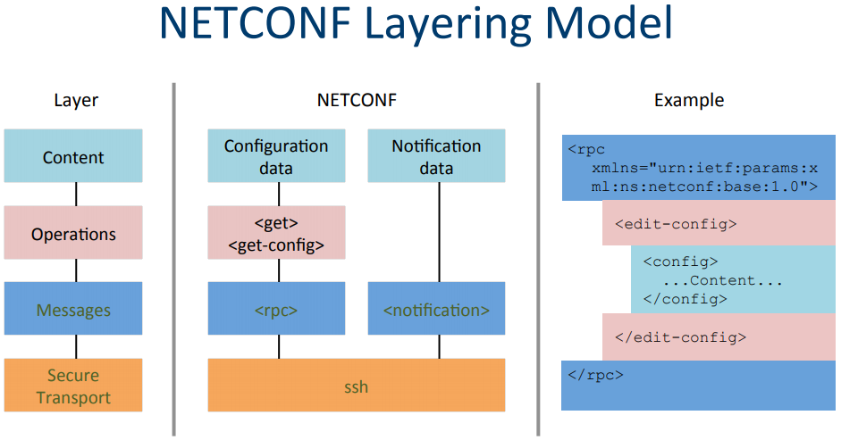

# Netconf 学习笔记

## 1. Netconf简介

随着SDN的大热，一个诞生了十年之久的协议焕发了第二春，它就是NETCONF协议。如果你在两年前去搜索NETCONF协议，基本得到的信息都是“这个协议是一个网管协议，主要目的是弥补SNMP协议的不足，希望可以取代SNMP协议”。SNMP有哪些不足，而NETCONF是否真的能够弥补，这都不是重点，重点是NETCONF诞生至今SNMP依旧活的好好的。所以如果我们还是把NETCONF当做一个网管协议的话，估计它会在冷板凳上一直坐下去，而如果我们换一个角度去看待NETCONF协议，你会发现也许它是最适合SDN的一个协议。

NETCONF的自动化配置系统采用Client/Server架构，而netopeer即实现了netconf的C/S框架的开源项目。

Netopeer是基于开源项目libnetconf库完成的，已实现client和server端的代码。主要涉及的组件为netopeer-cli和netopeer-server；其中netopeer-cli为一个CLI程序，允许通过该程序连接到netconfserver，和操纵它的配置数据；netopeer-server为一个netconf服务器端的守护进程，允许与netconf client建立连接，接收配置数据等操作。除了这两个重要的模块，netopeer项目还包含了libnetconf transAPI模块举例，位于项目源码transAPI/路径下，例如cfgsystem模块，实现的是一个ietf-system数据模型。

## 2. Netconf架构

NETCONF是一个基于XML的交换机配置接口，用于替代CLI、SNMP等配置交换机。

> 本质上来说,NETCONF就是利用XML-RPC的通讯机制实现配置客户端和配置服务端之间的通信，实现对网络设备的配置和管理。

NETCONF分为四个层：安全传输层、消息层、操作层、内容层。



- **安全传输层**：用于跟交换机安全通信，NETCONF并未规定具体使用哪种传输层协议，所以可以使用SSH、TLS、HTTP等各种协议

- **消息层**：提供一种传输无关的消息封装格式，用于RPC通信
- **操作层**：定义了一系列的RPC调用方法，并可以通过Capabilities来扩展
- **内容层**：定义RPC调用的数据内容

NETCONF关键技术实现：

> 关键的环节包括：安全认证、建立加密传输通道、rpc-xml消息收发、rpc-xml文件解析、rpc-reply消息的生成。

## 3. Netconf环境搭建

基于centos7搭建环境：

```shell
$ sudo yum install libtool
$ sudo yum install libxml2-devel
$ sudo yum install libxslt-devel
$ sudo yum install libcurl-devel
$ sudo yum install python-setuptools
$ sudo yum install pkg-config
$ sudo yum install readline-devel
```

### pyang 编译安装

```shell
$ git clone https://github.com/mbj4668/pyang.git
$ cd pyang
$ python setup.py install
```

### libssh (>=0.6.4) 编译安装

```shell
$ sudo yum install libssh-devel
# or
$ git clone https://git.libssh.org/projects/libssh.git libssh
$ cd libssh
$ mkdir build
$ cd build
$ cmake ..
$ make
$ sudo make install
$ cd ..
```

### libnetconf 编译安装

```shell
$ git clone https://github.com/CESNET/libnetconf.git
$ cd libnetconf
$ ./configure
$ make
$ sudo make install
```

### netopeeran编译安装

```shell
$ git clone https://github.com/CESNET/netopeer.git

# 编译安装netopeer-server
$ cd netopeer/server
$ ./configure
$ make
$ sudo make install

# 编译安装netopeer-cli
$ cd netopeer/cli
$ ./configure
$ make
$ sudo make install
```

### netopeer 启动与验证

启动netopeer server

```shell
$ netopeer-server -d
# 默认监听端口x.x.x.x:830，连接的用户名密码为系统用户
```

验证 netopeer-cli 与 netopeer-server 连接

```shell
$ netopeer-cli
netconf> connect localhost
netconf> get-config startup
```

其它操作

```shell
# a) 配置netopeer server模块
$ netopeer-configurator

# b) 检查默认启动的模块
$ netopeer-manager list
```

## 4. Netconf案例使用

### 工具lnctool

假设经过第一步后成功编译出libnetconf和netopeer，这样我们就可以直接运行netopeer。netconf默认监听端口是830端口。

众所周知，netconf协议支持自定义rpc，因此此步骤需要做的是如何在现有netconf中增加自己的yang模型以及执行自己的rpc？？

这里就需要用到这个工 `lnctool`。这个工具是用python实现的，里面代码也比较简单，比如说调用其他应用程序（pyang）或者直接写文件。


```shell
$ lnctool --model ./turing-machine.yang transapi --paths ./path
```

另外一个重点是就是实现源文件中相关接口—rpc函数。当经过以上两个步骤之后，就可以进行编译，默认编译出动态库.so文件。

当我们把rpc函数实现之后，就可以通过另外一个工具，netopeer-manager安装自定义模型，使用命令行如下：

```shell
$ netopeer-manager add --name [module name]  --model  [model path]  --transapi  [model share library]  --datastore [module datastore file]

$ netopeer-manager add --name turing-machine --model /usr/local/etc/netopeer/turing-machine/turing-machine.yin --transapi /usr/local/lib/turing-machine.so --datastore /usr/local/etc/netopeer/turing-machine/datastore.xml
```

### turing-machine demo

#### 1. 编译 turing-machine

```shell
$ autoreconf --force --install
$ ./configure
$ make
```

#### 2. 检查 xml

```shell
$ cat /usr/local/etc/netopeer/cfgnetopeer/datastore.xml 
<?xml version="1.0"?>
<datastores xmlns="urn:cesnet:tmc:datastores:file">
  <running lock="">
    <netopeer xmlns="urn:cesnet:tmc:netopeer:1.0">
      <modules>
        <module>
          <name>turing-machine</name>
          <enabled>true</enabled>
        </module>
      </modules>
    </netopeer>
  </running>
  <startup lock="">
    <netopeer xmlns="urn:cesnet:tmc:netopeer:1.0">
      <modules>
        <module>
          <name>turing-machine</name>
          <enabled>true</enabled>
        </module>
      </modules>
    </netopeer>
  </startup>
  <candidate lock="" modified="false" locktime="">
    <netopeer xmlns="urn:cesnet:tmc:netopeer:1.0">
      <modules>
        <module>
          <name>turing-machine</name>
          <enabled>true</enabled>
        </module>
      </modules>
    </netopeer>
  </candidate>
</datastores>

$ cat /usr/local/etc/netopeer/cfgnetopeer/datastore-server.xml 
<?xml version="1.0" encoding="UTF-8"?>
<datastores xmlns="urn:cesnet:tmc:datastores:file">
  <running lock=""/>
  <startup lock=""/>
  <candidate modified="false" lock="" locktime=""/>
</datastores>
```

#### 3. 安装模块

```shell
$ su root
$ cp turing-machine.yin /usr/local/etc/netopeer/turing-machine/
$ cp .libs/turing-machine.so /usr/local/lib
$ cp turing-machine.la /usr/local/lib
$ netopeer-manager add --name turing-machine --model /usr/local/etc/netopeer/turing-machine/turing-machine.yin --transapi /usr/local/lib/turing-machine.so --datastore /usr/local/etc/netopeer/turing-machine/datastore.xml
```

#### 4. netopeer-manager list

```shell
$ netopeer-manager list
Reading the configuration from /usr/local/etc/netopeer/modules.conf.d/
List of startup Netopeer modules:
turing-machine (enabled)
```

#### 5. 启动 netopeer-server

```shell
$ netopeer-server -v 3
...
```

#### 6. 启动 netopeer-cli

使用命令:

- connect 192.168.205.98 
- get 
- lock candidate 
- edit-config candidate
- commit 
- unlock candidate 
- get-config running Get-config 
- edit-config candidate

```shell
$ netopeer-cli
netconf> connect 192.168.205.98
The authenticity of the host '192.168.205.98' cannot be established.
ssh-rsa key fingerprint is 9f:c8:f9:13:7d:04:b8:18:e9:4d:4e:9c:cb:63:84:17:0b:d9:ad:6a.
Are you sure you want to continue connecting (yes/no)? yes
root@192.168.205.98 password: 
netconf> get
......
netconf> lock candidate
  Result OK
netconf> debug
Verbose level set to DEBUG
netconf> edit-config --defop=merge --config=/root/turing.xml candidate
libnetconf DEBUG: 4984-D  1-26 14:34:38 Writing message (session 1): 
<?xml version="1.0" encoding="UTF-8"?>
<rpc xmlns="urn:ietf:params:xml:ns:netconf:base:1.0" message-id="3">
  <edit-config>
    <target>
      <candidate/>
    </target>
    <default-operation>merge</default-operation>
    <config>
      <turing-machine xmlns="http://example.net/turing-machine" xmlns:xc="urn:ietf:params:xml:ns:netconf:base:1.0">
        <transition-function xc:operation="merge">
          <delta>
            <label>0</label>
            <input>
              <state>0</state>
              <symbol>0</symbol>
            </input>
            <output>
              <state>0</state>
              <symbol>1</symbol>
            </output>
          </delta>
        </transition-function>
      </turing-machine>
    </config>
  </edit-config>
</rpc>

libnetconf DEBUG: 4984-D  1-26 14:34:38 11--Received message (session 1): <?xml version="1.0" encoding="UTF-8"?>
<rpc-reply xmlns="urn:ietf:params:xml:ns:netconf:base:1.0" message-id="3">
  <ok/>
</rpc-reply>


  Result OK
netconf> commit
libnetconf DEBUG: 4984-D  1-26 14:35: 9 Writing message (session 1): <?xml version="1.0" encoding="UTF-8"?>
<rpc xmlns="urn:ietf:params:xml:ns:netconf:base:1.0" message-id="4">
  <commit/>
</rpc>

libnetconf DEBUG: 4984-D  1-26 14:35: 9 11--Received message (session 1): <?xml version="1.0" encoding="UTF-8"?>
<rpc-reply xmlns="urn:ietf:params:xml:ns:netconf:base:1.0" message-id="4">
  <ok/>
</rpc-reply>


  Result OK
```

#### 7. check datastore.xml

```shell
$ cat /usr/local/etc/netopeer/turing-machine/datastore.xml 
<?xml version="1.0" encoding="UTF-8"?>
<datastores xmlns="urn:cesnet:tmc:datastores:file">
  <running lock="">
    <turing-machine xmlns="http://example.net/turing-machine">
      <transition-function>
        <delta>
          <label>0</label>
          <input>
            <state>0</state>
            <symbol>0</symbol>
          </input>
          <output>
            <state>0</state>
            <symbol>1</symbol>
          </output>
        </delta>
      </transition-function>
    </turing-machine>
  </running>
  <startup lock=""/>
  <candidate modified="true" lock="1" locktime="2018-01-26T06:33:55Z">
    <turing-machine xmlns="http://example.net/turing-machine">
      <transition-function>
        <delta>
          <label>0</label>
          <input>
            <state>0</state>
            <symbol>0</symbol>
          </input>
          <output>
            <state>0</state>
            <symbol>1</symbol>
          </output>
        </delta>
      </transition-function>
    </turing-machine>
  </candidate>
</datastores>
```

OK, unlock candidate:

```shell
netconf> unlock candidate
libnetconf DEBUG: 4984-D  1-26 14:38: 4 Writing message (session 1): <?xml version="1.0" encoding="UTF-8"?>
<rpc xmlns="urn:ietf:params:xml:ns:netconf:base:1.0" message-id="5">
  <unlock>
    <target>
      <candidate/>
    </target>
  </unlock>
</rpc>

libnetconf DEBUG: 4984-D  1-26 14:38: 4 11--Received message (session 1): <?xml version="1.0" encoding="UTF-8"?>
<rpc-reply xmlns="urn:ietf:params:xml:ns:netconf:base:1.0" message-id="5">
  <ok/>
</rpc-reply>


  Result OK
netconf> 
```

unlock is successfully

server's output:

```shell
netopeer-server[4981]: 4981-D  1-26 14:38: 4 11--Received message (session 1): <?xml version="1.0" encoding="UTF-8"?>
<rpc xmlns="urn:ietf:params:xml:ns:netconf:base:1.0" message-id="5">
  <unlock>
    <target>
      <candidate/>
    </target>
  </unlock>
</rpc>
netopeer-server[4981]: 4981-V  1-26 14:38: 4 Created dummy session 0 for user 'root' (UID 0) - recovery session
netopeer-server[4981]: 4981-V  1-26 14:38: 4 Created dummy session 0 for user 'root' (UID 0) - recovery session
netopeer-server[4981]: 4981-D  1-26 14:38: 4 Adding new event (0)
netopeer-server[4981]: 4981-V  1-26 14:38: 4 Created dummy session 0 for user 'root' (UID 0) - recovery session
netopeer-server[4981]: 4981-D  1-26 14:38: 4 Writing message (session 1): <?xml version="1.0" encoding="UTF-8"?>
<rpc-reply xmlns="urn:ietf:params:xml:ns:netconf:base:1.0" message-id="5">
  <ok/>
</rpc-reply>
```

### turing-machine demo get操作案例

running datestore 内容：

```xml
netconf> get-config running

  Result:
<turing-machine xmlns="http://example.net/turing-machine">
    <transition-function>
      <delta>
        <label>0</label>
        <input>
          <state>0</state>
          <symbol>0</symbol>
        </input>
        <output>
          <state>0</state>
          <symbol>1</symbol>
        </output>
      </delta>
      <delta>
        <label>1</label>
        <input>
          <state>0</state>
          <symbol>1</symbol>
        </input>
        <output>
          <state>0</state>
          <symbol>0</symbol>
        </output>
      </delta>
      <delta>
        <label>end</label>
        <input>
          <state>0</state>
          <symbol/>
        </input>
        <output>
          <state>1</state>
        </output>
      </delta>
    </transition-function>
  </turing-machine><netopeer xmlns="urn:cesnet:tmc:netopeer:1.0">
    <modules>
      <module>
        <name>turing-machine</name>
        <enabled>true</enabled>
      </module>
    </modules>
  </netopeer>
netconf>
```

准备get xml文件：

```xml
<!-- turing-machine-get-test.xml -->
<turing-machine xmlns="http://example.net/turing-machine">
	<transition-function>
		<delta>
			<label>0</label>
		</delta>
	</transition-function>
</turing-machine>
```

netopeer-cli 命令：

```xml
netconf> get --filter=/turing-machine-get-test.xml

  Result:
<turing-machine xmlns="http://example.net/turing-machine">
    <transition-function>
      <delta>
        <label>0</label>
        <input>
          <state>0</state>
          <symbol>0</symbol>
        </input>
        <output>
          <state>0</state>
          <symbol>1</symbol>
        </output>
      </delta>
    </transition-function>
  </turing-machine>
```

netopeer-server log：

```xml
netopeer-server[127219]: Received message (session 4): <?xml version="1.0" encoding="UTF-8"?>
<rpc xmlns="urn:ietf:params:xml:ns:netconf:base:1.0" message-id="34">
  <get>
    <filter type="subtree">
      <turing-machine xmlns="http://example.net/turing-machine">
        <transition-function>
          <delta>
            <label>0</label>
          </delta>
        </transition-function>
      </turing-machine>
    </filter>
  </get>
</rpc>
netopeer-server[127219]: Merging the node turing-machine (src/datastore/edit_config.c:2325)
netopeer-server[127219]: Deleting the node turing-machine (src/datastore/edit_config.c:1003)
netopeer-server[127219]: Writing message (session 4): <?xml version="1.0" encoding="UTF-8"?>
<rpc-reply xmlns="urn:ietf:params:xml:ns:netconf:base:1.0" message-id="34">
  <data>
    <turing-machine xmlns="http://example.net/turing-machine">
      <transition-function>
        <delta>
          <label>0</label>
          <input>
            <state>0</state>
            <symbol>0</symbol>
          </input>
          <output>
            <state>0</state>
            <symbol>1</symbol>
          </output>
        </delta>
      </transition-function>
    </turing-machine>
  </data>
</rpc-reply>
```

### 配置netopeer服务器模块

要查找要添加YANG模块的默认位置，请运行

```shell
$ sudo /usr/bin/netopeer-configurator
```

你可以在[Netopeer]一栏找到以下信息

```shell
[Netopeer]     Using modules installed in path: /usr/local/etc/netopeer/modules.conf.d
```

默认情况下，所有模块的XML实例数据(Netopeer调用这个数据存储，不幸的是，使用与NETCONF的运行/候选/启动数据存储相同的术语)存储在 `/usr/local/etc/Netopeer/modules.conf.d`中

当您使用 `netopier -manager` 添加模块时，`—datastore` 选项应该指向 `/usr/local/etc/netopeer/modules.conf.d`

使用 `netopier -manager` 的例子:

首先检查哪些模块是默认启用的:

```shell
$ netopeer-manager list
List of startup Netopeer modules:No module installed.
```

没有安装模块。让我们添加一些模块。要添加模型，首先使用PyangNETCONFc转换 `.yang` 文件 `yin文件`。Netopeer内部使用 YIN 格式。例如，让我们添加 toaster 数据存储，这样您就可以使用NETCONFc来配置它。

Download toaster.yang from[ http://seguesoft.com/get-standard-yang-modules](http://www.seguesoft.com/get-standard-yang-modules). Then you can do:

```shell
$ pyang -f yin /home/bob/YANG_modules/toaster.yang -o /home/bob/YANG_modules/toaster.yin
```

Then add toaster.yin's datastore into Netopeer as follows

```shell
$ netopeer-manager add --name toaster --model /home/bob/YANG_modules/toaster.yin --datastore /usr/local/etc/netopeer/modules.conf.d/toaster.xml
```

对于命令引用类型

```shell
$ netopeer-manager add --help     
To actually implement a model, see http://github.com/CESNET/netopeer/tree/master/transAPI/cfgsystem
```

### 操作过程：

```shell
# xml 生成
$ pyang -f sample-xml-skeleton turing-machine.yang -o turing-machine.xml
# 生成 rpc 接口代码
$ lnctool --model ./turing-machine.yang transapi --paths ./path
# netconf log 接口 
nc_verb_verbose("Miaow: Turing machine transapi_init...");
# 编译 rpc 模块代码，并安装模块
$ autoreconf --force --install
$ ./configure
$ make
$ sudo make install
# 查看已安装的模块
$ netopeer-manager list
$ man netopeer-manager
```

启动服务测试：

```shell
$ sudo /usr/local/bin/netopeer-server -v 3
$ sudo /usr/local/bin/netopeer-cli
netconf> help
#  Available commands:
#  help            Display this text
#  connect         Connect to a NETCONF server
#  listen          Listen for a NETCONF Call Home
#  disconnect      Disconnect from a NETCONF server
#  commit          NETCONF <commit> operation
#  copy-config     NETCONF <copy-config> operation
#  delete-config   NETCONF <delete-config> operation
#  discard-changes NETCONF <discard-changes> operation
#  edit-config     NETCONF <edit-config> operation
#  get             NETCONF <get> operation
#  get-config      NETCONF <get-config> operation
#  get-schema      NETCONF <get-schema> operation
#  kill-session    NETCONF <kill-session> operation
#  lock            NETCONF <lock> operation
#  unlock          NETCONF <unlock> operation
#  validate        NETCONF <validate> operation
#  test            Run a specified test case
#  subscribe       NETCONF Event Notifications <create-subscription> operation
#  time            Enable/disable measuring time of command execution
#  knownhosts      Manage known hosts in the "~/.ssh/known_hosts" file
#  status          Print information about the current NETCONF session
#  user-rpc        Send your own content in an RPC envelope (for DEBUG purposes)
#  verbose         Enable/disable verbose messages
#  quit            Quit the program
#  auth            Manage SSH authentication options
#  capability      Add/remove capability to/from the list of supported capabilities
#  editor          Manage the editor to be used for manual XML pasting/writing
netconf> connect 127.0.0.1
netconf> get -h
# get [--help] [--defaults report-all|report-all-tagged|trim|explicit] [--filter [file]] [--out file]
netconf> get --filter=/root/turing.xml
netconf> get-config -h
# get-config [--help] [--defaults report-all|report-all-tagged|trim|explicit] [--filter [file]] [--out file] running|startup|candidate

netconf> get-config --filter=/root/turing.xml candidate
netconf> edit-config -h
# edit-config [--help] [--defop <merge|replace|none>] [--error <stop|continue|rollback>] [--test <set|test-only|test-then-set>] [--config <file> | --url <url>] running|startup|candidate
# If neither --config nor --url is specified, user is prompted to set edit data manually.
netconf> lock candidate
netconf> debug
netconf> edit-config --defop=merge --config=/root/turing.xml candidate
netconf> commit
netconf> unlock candidate
netconf> 
netconf> user-rpc --file=/root/rpc-run.xml
```

## 5. turing-machine 操作层示例

安装好 turing-machine 之后，可以对模块做一些操作，以下为实际的操作过程以及对应的xml编写示例。

`<edit-config>` 详解：

**描述：**

``操作将全部或部分指定配置加载到指定的目标配置数据存储。此操作允许以多种方式表示新配置，例如使用本地文件，远程文件或内联。如果目标配置数据存储不存在，它将被创建。

如果一个`NETCONF`节点(`peer`)支持：`url`能力（[8.8节](https://tools.ietf.org/html/rfc6241#section-8.8)），那么``元素可以出现而不是``参数。

设备分析源和目标配置并执行所请求的更改。目标配置不一定被替换，就像``消息一样。而是根据源数据和请求的操作来更改目标配置。

如果``操作包含应用于基础数据模型中相同概念节点的多个子操作，则操作的结果是未定义的（即，不在`NETCONF协`议的范围之内）。

**属性：**

- `operation`：``子树中的元素可以包含一个“`operation`”属性，它属于[3.1](https://tools.ietf.org/html/rfc6241#section-3.1)节定义的`NETCONF`名称空间。该属性标识配置中的要执行该操作的点，并可以在整个``子树中的多个元素上出现。如果未指定“`operation`”属性，则配置将合并到配置数据存储中。 “`operation`”属性具有以下值之一：
    - `merge`：由包含此属性的元素标识的配置数据与由``参数标识的配置数据存储中对应级别的配置合并。这是默认行为。
    - `replace`：由包含此属性的元素标识的配置数据将替换由``参数标识的配置数据存储区中的任何相关配置。如果配置数据存储中不存在此类配置数据，则会创建它。与替换整个目标配置的``操作不同，只有实际存在于``参数中的配置受到影响。
    - `create`：当且仅当配置数据存在于配置数据存储中时，才将包含此属性的元素标识的配置数据添加到配置中。如果配置数据存在，则返回一个``值为“`data-exists`”的``元素。
    - `delete`：当且仅当配置数据当前存在于配置数据存储中时，才从配置中删除由包含此属性的元素标识的配置数据。如果配置数据不存在，则返回一个``值为“`data-missing`”的``元素。
    - `remove`：如果配置数据当前存在于配置数据存储中，则从配置中删除由包含此属性的元素标识的配置数据。如果配置数据不存在，服务器会自动忽略“`remove`”操作。

**参数：**

- `target`：正在编辑的配置数据存储的名称，例如``或``。
- `default-operation`：选择此``请求的默认操作（如“`operation`”属性中所述）。 ``参数的默认值是`“merge`”。``参数是可选的，但是如果提供，它具有以下值之一：
    - `merge`：``参数中的配置数据与目标数据存储中相应级别的配置合并。这是默认行为。
    - `replace`：``参数中的配置数据完全替换了目标数据存储中的配置。这对加载以前保存的配置数据很有用。
    - `none`：目标数据存储不受``参数中的配置影响，除非和直到传入的配置数据使用“`operation`”属性请求不同的操作。如果``参数中的配置包含目标数据存储中没有相应级别的数据，则返回``，并带有``缺少数据的值。使用“`none`”允许像“`delete`”这样的操作避免无意中创建要删除的元素的父层次结构。
- `test-option`：只有当设备公布支持`:validate:1.1`能力时才能指定``元素（[8.6节](https://tools.ietf.org/html/rfc6241#section-8.6)）。``元素具有以下值之一：
    - `test-then-set`：在尝试设置之前执行验证测试。 如果发生验证错误，请不要执行``操作。 这是默认的测试选项。
    - `set`：先执行一个没有验证测试的设置。
    - `test-only`：仅执行验证测试，而不尝试设置。
- `error-option`：``元素具有以下值之一：
    - `stop-on-error`：停止第一个错误的``操作。这是默认的错误选项。
    - `continue-on-error`：继续处理错误的配置数据;记录错误，如果发生任何错误，则产生否定响应。
    - `rollback-on-error`：如果发生错误情况，从而生成错误严重性``元素，则服务器将停止处理``操作，并在指定的开始时将指定的配置恢复到完整状态这个``操作。该选项要求服务器支持[8.5节](https://tools.ietf.org/html/rfc6241#section-8.5)中描述的错误回滚功能。
- `config`：配置数据的层次结构，由设备的一个数据模型定义。内容必须放置在适当的命名空间中，以允许设备检测适当的数据模型，并且内容必须遵循该数据模型的约束，如其能力定义所定义。能力在[第8节](https://tools.ietf.org/html/rfc6241#section-8)讨论。

### 创建实例

`turing.xml` 内容如下：

```xml
<?xml version="1.0" encoding="UTF-8"?>
<turing-machine xmlns="http://example.net/turing-machine">
  <transition-function>
    <delta>
      <label>0</label>
      <input>
        <state>0</state>
        <symbol>0</symbol>
      </input>
      <output>
        <state>0</state>
        <symbol>1</symbol>
      </output>
    </delta>
    <delta>
      <label>1</label>
      <input>
        <state>0</state>
        <symbol>1</symbol>
      </input>
      <output>
        <state>0</state>
        <symbol>0</symbol>
      </output>
    </delta>
    <delta>
      <label>end</label>
      <input>
        <state>0</state>
        <symbol/>
      </input>
      <output>
        <state>1</state>
      </output>
    </delta>
  </transition-function>
</turing-machine>
```

为 turing-machine 创建实例：

```shell
netconf> edit-config --defop=merge --config=/root/turing.xml candidate
libnetconf DEBUG: Writing message (session 7): <?xml version="1.0" encoding="UTF-8"?>
<rpc xmlns="urn:ietf:params:xml:ns:netconf:base:1.0" message-id="8">
  <edit-config>
    <target>
      <candidate/>
    </target>
    <default-operation>merge</default-operation>
    <config>
      <turing-machine xmlns="http://example.net/turing-machine">
        <transition-function>
          <delta>
            <label>0</label>
            <input>
              <state>0</state>
              <symbol>0</symbol>
            </input>
            <output>
              <state>0</state>
              <symbol>1</symbol>
            </output>
          </delta>
          <delta>
            <label>1</label>
            <input>
              <state>0</state>
              <symbol>1</symbol>
            </input>
            <output>
              <state>0</state>
              <symbol>0</symbol>
            </output>
          </delta>
          <delta>
            <label>end</label>
            <input>
              <state>0</state>
              <symbol/>
            </input>
            <output>
              <state>1</state>
            </output>
          </delta>
        </transition-function>
      </turing-machine>
    </config>
  </edit-config>
</rpc>

libnetconf DEBUG: Received message (session 7): <?xml version="1.0" encoding="UTF-8"?>
<rpc-reply xmlns="urn:ietf:params:xml:ns:netconf:base:1.0" message-id="8">
  <ok/>
</rpc-reply>
```

### 删除数据

`delete-delta.xml` 内容如下：

```xml
<?xml version="1.0" encoding="UTF-8"?>
<turing-machine xmlns="http://example.net/turing-machine" xmlns:xc="urn:ietf:params:xml:ns:netconf:base:1.0">
    <transition-function>
        <delta xc:operation="remove">
            <label>1</label>
        </delta>
    </transition-function>
</turing-machine>
```

删除 delta 中的一项：

```shell
netconf> edit-config --defop=none --config=/root/delete-delta.xml candidate
libnetconf DEBUG: Writing message (session 7): <?xml version="1.0" encoding="UTF-8"?>
<rpc xmlns="urn:ietf:params:xml:ns:netconf:base:1.0" message-id="13">
  <edit-config>
    <target>
      <candidate/>
    </target>
    <default-operation>none</default-operation>
    <config>
      <turing-machine xmlns="http://example.net/turing-machine" xmlns:xc="urn:ietf:params:xml:ns:netconf:base:1.0">
        <transition-function>
          <delta xc:operation="remove">
            <label>1</label>
          </delta>
        </transition-function>
      </turing-machine>
    </config>
  </edit-config>
</rpc>

libnetconf DEBUG: Received message (session 7): <?xml version="1.0" encoding="UTF-8"?>
<rpc-reply xmlns="urn:ietf:params:xml:ns:netconf:base:1.0" message-id="13">
  <ok/>
</rpc-reply>

netconf> get-config candidate
libnetconf DEBUG: Writing message (session 7): <?xml version="1.0" encoding="UTF-8"?>
<rpc xmlns="urn:ietf:params:xml:ns:netconf:base:1.0" message-id="14">
  <get-config>
    <source>
      <candidate/>
    </source>
  </get-config>
</rpc>

libnetconf DEBUG: Received message (session 7): <?xml version="1.0" encoding="UTF-8"?>
<rpc-reply xmlns="urn:ietf:params:xml:ns:netconf:base:1.0" message-id="14">
  <data>
    <turing-machine xmlns="http://example.net/turing-machine">
      <transition-function>
        <delta>
          <label>0</label>
          <input>
            <state>0</state>
            <symbol>0</symbol>
          </input>
          <output>
            <state>0</state>
            <symbol>1</symbol>
          </output>
        </delta>
        <delta>
          <label>end</label>
          <input>
            <state>0</state>
            <symbol/>
          </input>
          <output>
            <state>1</state>
          </output>
        </delta>
      </transition-function>
    </turing-machine>
  </data>
</rpc-reply>
```

### 创建数据

`create-delta.xml` 内容如下：

```xml
<?xml version="1.0" encoding="UTF-8"?>
<turing-machine xmlns="http://example.net/turing-machine" xmlns:xc="urn:ietf:params:xml:ns:netconf:base:1.0">
  <transition-function>
    <delta xc:operation="create">
      <label>3</label>
      <input>
        <state>0</state>
        <symbol>1</symbol>
      </input>
      <output>
        <state>1</state>
        <symbol>1</symbol>
      </output>
    </delta>
  </transition-function>
</turing-machine>
```

创建 delta 数据：

```shell
netconf> edit-config --defop=none --config=/root/create-delta.xml candidate
```

### 合并和替换数据

`merge-delta.xml` 内容如下：

```xml
<?xml version="1.0" encoding="UTF-8"?>
<turing-machine xmlns="http://example.net/turing-machine" xmlns:xc="urn:ietf:params:xml:ns:netconf:base:1.0">
  <transition-function>
    <delta xc:operation="merge">
      <label>0</label>
      <input>
        <state>1</state>
        <symbol>1</symbol>
      </input>
      <output>
        <state>1</state>
        <symbol>1</symbol>
      </output>
    </delta>
  </transition-function>
</turing-machine>
```

`replace-delta.xml` 内容如下：

```xml
<?xml version="1.0" encoding="UTF-8"?>
<turing-machine xmlns="http://example.net/turing-machine" xmlns:xc="urn:ietf:params:xml:ns:netconf:base:1.0">
  <transition-function>
    <delta xc:operation="replace">
      <label>3</label>
      <input>
        <state>0</state>
        <symbol>0</symbol>
      </input>
      <output>
        <state>0</state>
        <symbol>0</symbol>
      </output>
    </delta>
  </transition-function>
</turing-machine>
```

合并和替换 delta：

```shell
netconf> edit-config --defop=none --config=/root/merge-delta.xml candidate
netconf> edit-config --defop=none --config=/root/replace-delta.xml candidate
```

### 获取数据

`get-turing.xml` 内容如下：

```xml
<?xml version="1.0" encoding="UTF-8"?>
<turing-machine xmlns="http://example.net/turing-machine">
</turing-machine>
```

`get-delta-0.xml` 内容如下：

```xml
<?xml version="1.0" encoding="UTF-8"?>
<turing-machine xmlns="http://example.net/turing-machine">
	<transition-function>
		<delta>
			<label>0</label>
		</delta>
	</transition-function>
</turing-machine>
```

获取特定数据：

```shell
netconf> get --filter=/root/get-turing.xml
libnetconf DEBUG: Writing message (session 7): <?xml version="1.0" encoding="UTF-8"?>
<rpc xmlns="urn:ietf:params:xml:ns:netconf:base:1.0" message-id="17">
  <get>
    <filter type="subtree">
      <turing-machine xmlns="http://example.net/turing-machine">
</turing-machine>
    </filter>
  </get>
</rpc>

libnetconf DEBUG: Received message (session 7): <?xml version="1.0" encoding="UTF-8"?>
<rpc-reply xmlns="urn:ietf:params:xml:ns:netconf:base:1.0" message-id="17">
  <data>
    <turing-machine xmlns="http://example.net/turing-machine">
      <transition-function>
        <delta>
          <label>0</label>
          <input>
            <state>0</state>
            <symbol>0</symbol>
          </input>
          <output>
            <state>0</state>
            <symbol>1</symbol>
          </output>
        </delta>
        <delta>
          <label>1</label>
          <input>
            <state>0</state>
            <symbol>1</symbol>
          </input>
          <output>
            <state>0</state>
            <symbol>0</symbol>
          </output>
        </delta>
        <delta>
          <label>end</label>
          <input>
            <state>0</state>
            <symbol/>
          </input>
          <output>
            <state>1</state>
          </output>
        </delta>
      </transition-function>
      <state>0</state>
      <head-position>0</head-position>
      <tape>
        <cell>
          <coord>0</coord>
          <symbol>0</symbol>
        </cell>
      </tape>
    </turing-machine>
  </data>
</rpc-reply>

netconf> get --filter=/root/get-delta-0.xml
libnetconf DEBUG: Writing message (session 7): <?xml version="1.0" encoding="UTF-8"?>
<rpc xmlns="urn:ietf:params:xml:ns:netconf:base:1.0" message-id="18">
  <get>
    <filter type="subtree">
      <turing-machine xmlns="http://example.net/turing-machine">
        <transition-function>
          <delta>
            <label>0</label>
          </delta>
        </transition-function>
      </turing-machine>
    </filter>
  </get>
</rpc>

libnetconf DEBUG: Received message (session 7): <?xml version="1.0" encoding="UTF-8"?>
<rpc-reply xmlns="urn:ietf:params:xml:ns:netconf:base:1.0" message-id="18">
  <data>
    <turing-machine xmlns="http://example.net/turing-machine">
      <transition-function>
        <delta>
          <label>0</label>
          <input>
            <state>0</state>
            <symbol>0</symbol>
          </input>
          <output>
            <state>0</state>
            <symbol>1</symbol>
          </output>
        </delta>
      </transition-function>
    </turing-machine>
  </data>
</rpc-reply>
```

### 自定义 rpc 方法调用

`rpc-initialize.xml ` 内容如下：

```xml
<?xml version="1.0" encoding="UTF-8"?>
<initialize xmlns="http://example.net/turing-machine">
    <tape-content>0</tape-content>
</initialize>
```

执行 rpc-initialize ：

```shell
netconf> user-rpc --file=/root/rpc-initialize.xml
libnetconf DEBUG: Writing message (session 7): <?xml version="1.0" encoding="UTF-8"?>
<rpc xmlns="urn:ietf:params:xml:ns:netconf:base:1.0" message-id="19">
  <initialize xmlns="http://example.net/turing-machine">
    <tape-content>0</tape-content>
  </initialize>
</rpc>

libnetconf DEBUG: Received message (session 7): <?xml version="1.0" encoding="UTF-8"?>
<rpc-reply xmlns="urn:ietf:params:xml:ns:netconf:base:1.0" message-id="19">
  <ok/>
</rpc-reply>
```

server 响应内容：

```shell
netopeer-server[14444]: Received message (session 7): <?xml version="1.0" encoding="UTF-8"?>
<rpc xmlns="urn:ietf:params:xml:ns:netconf:base:1.0" message-id="20">
  <initialize xmlns="http://example.net/turing-machine">
    <tape-content>0</tape-content>
  </initialize>
</rpc>
netopeer-server[14444]: Calling initialize RPC function
netopeer-server[14444]: Miaow: Turing machine rpc_initialize...
netopeer-server[14444]: Miaow: Turing machine get_rpc_node...
netopeer-server[14444]: Writing message (session 7): <?xml version="1.0" encoding="UTF-8"?>
<rpc-reply xmlns="urn:ietf:params:xml:ns:netconf:base:1.0" message-id="20">
  <ok/>
</rpc-reply>
```

`rpc-run.xml` 内容如下：

```xml
<?xml version="1.0" encoding="UTF-8"?>
<run xmlns="http://example.net/turing-machine">
</run>
```

执行 rpc-run ：

```shell
netconf> user-rpc --file=/root/rpc-run.xml
libnetconf DEBUG: Writing message (session 7): <?xml version="1.0" encoding="UTF-8"?>
<rpc xmlns="urn:ietf:params:xml:ns:netconf:base:1.0" message-id="21">
  <run xmlns="http://example.net/turing-machine">
</run>
</rpc>

libnetconf DEBUG: Received message (session 7): <?xml version="1.0" encoding="UTF-8"?>
<rpc-reply xmlns="urn:ietf:params:xml:ns:netconf:base:1.0" message-id="21">
  <ok/>
</rpc-reply>
```

server 响应内容：

```shell
netopeer-server[14444]: Received message (session 7): <?xml version="1.0" encoding="UTF-8"?>
<rpc xmlns="urn:ietf:params:xml:ns:netconf:base:1.0" message-id="21">
  <run xmlns="http://example.net/turing-machine">
</run>
</rpc>
netopeer-server[14444]: Calling run RPC function
netopeer-server[14444]: Miaow: Turing machine rpc_run...
netopeer-server[14444]: Writing message (session 7): <?xml version="1.0" encoding="UTF-8"?>
<rpc-reply xmlns="urn:ietf:params:xml:ns:netconf:base:1.0" message-id="21">
  <ok/>
</rpc-reply>
netopeer-server[14444]: Adding new event (0)
```

### notification 测试

TODO


## 6. Netconf总结

Netconf2

TODO

## Reference

### 模块下载地址

- **[[ Libnetconf文档网站 \]](https://rawgit.com/CESNET/libnetconf/master/doc/doxygen/html/index.html)**
- **[[ Netopeer项目 \]](https://github.com/CESNET/Netopeer)**
- **[[ Libnetconf项目 \]](https://github.com/CESNET/libnetconf)**
- **[[ Pyang项目 \]](https://github.com/mbj4668/pyang)**
- **[[ Libssh项目 \]](https://git.libssh.org/projects/libssh.git)**


### 模块编译安装

> [NETCONF协议netopeer软件安装与环境搭建](https://blog.csdn.net/rocson001/article/details/54575899)
>
> [Set up Netopeer Server to use with NETCONFc](http://www.seguesoft.com/index.php/how-to-set-up-netopeer-server-to-use-with-netconfc)
>
> [NETCONF协议之netopeer软件安装](https://blog.csdn.net/baiqishijkh/article/details/74006878)

### netconf学习资料

> [软件定义网络基础---NETCONF协议](https://www.cnblogs.com/ssyfj/p/11651450.html)
>
> [Netconf配置及其RPC和Notification下发流程解析](https://www.sdnlab.com/17786.html)
>
> [NETCONF协议详解](https://blog.csdn.net/CSND_PAN/article/details/79541868)
>
> [NETCONF模块设计介绍](https://blog.csdn.net/haopeng123321/article/details/54934542)
>
> [netopeer工具的使用](https://blog.csdn.net/mylifeyouwill/article/details/81539547)
>
> [【开源推介02-pyang】-你离yang模型只差一个pyang工具](https://blog.csdn.net/xinquanv1/article/details/88133803)

### netconf相关问题解决

> [An error occurred after executing the ‘commit‘’ command](https://github.com/CESNET/netopeer/issues/166)
>
> [cannot execute lock/unlock from netopeer-cli](https://github.com/CESNET/netopeer/issues/138)
>
> [YANG Tools:Yang1.1 Draft Yang Tools: Yang1.1 Draft](https://wiki.opendaylight.org/view/YANG_Tools:Yang1.1_Draft)
>
> [edit-config with delete="operation" not working](https://github.com/CESNET/Netopeer2/issues/333)

### 其他

> [关于RFC6241中文翻译](https://tonydeng.github.io/rfc6241-zh/)
>
> [YANG 1.1 数据建模语言](https://www.bookstack.cn/read/rfc7950-zh/README.md)
>
> [网络基础](https://tonydeng.github.io/sdn-handbook/)
>
> [NETCONF Support for Event Notifications](https://tools.ietf.org/id/draft-ietf-netconf-netconf-event-notifications-05.html)
>
> [Custom Subscription to Event Streams](https://tools.ietf.org/id/draft-ietf-netconf-subscribed-notifications-09.html)
>
> [YANG模型介绍及语法](https://wenku.baidu.com/view/6b812dbabe23482fb5da4c3f.html)
>
> [SDN实战团分享（七）：YANG模型与OpenDaylight南北向接口](https://www.sdnlab.com/14932.html)
>
> [深入浅出理解 YANG 模型](http://rennesong.com/2019/07/13/yang-model-tuto/)
>
> [配置NETCONF/YANG并且验证Cisco IOS XE 16.x平台的示例](https://www.cisco.com/c/zh_cn/support/docs/storage-networking/management/200933-YANG-NETCONF-Configuration-Validation.html)
>
> [Yang解析](https://blog.csdn.net/csnd_pan/article/details/79542917)
>
> [CloudEngine 7800&6800&5800 V100R003C00 配置指南-网络管理与监控配置](https://support.huawei.com/enterprise/zh/doc/EDOC1000074862?section=j006)
>
> [NE20E-S2 V800R010C10SPC500 配置指南 - 系统管理 01](https://support.huawei.com/enterprise/zh/doc/EDOC1100058323/d06526ed)
>
> [NETCONF 学习 -- python](https://kurisu.love/index.php/archives/155/)


